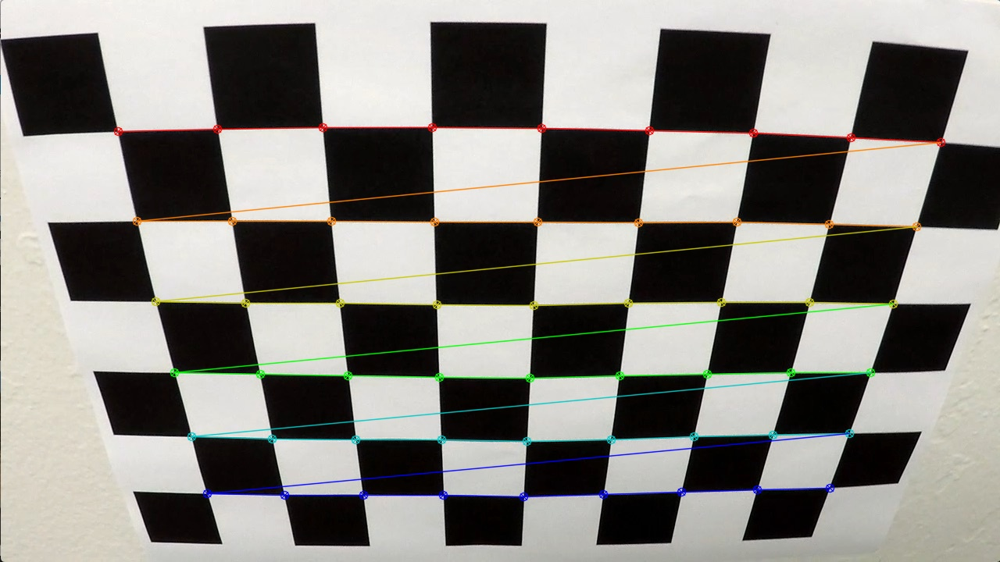

### Advanced Lane Finding Project
 

The goals / steps of this project are the following:

* Compute the camera calibration matrix and distortion coefficients given a set of chessboard images.
* Apply a distortion correction to raw images.
* Use color transforms, gradients, etc., to create a thresholded binary image.
* Apply a perspective transform to rectify binary image ("birds-eye view").
* Detect lane pixels and fit to find the lane boundary.
* Determine the curvature of the lane and vehicle position with respect to center.
* Warp the detected lane boundaries back onto the original image.
* Output visual display of the lane boundaries and numerical estimation of lane curvature and vehicle position.

[//]: # (Image References)

[image1]: ./examples/undistort_output.png "Undistorted"
[image2]: ./test_images/test1.jpg "Road Transformed"
[image3]: ./examples/binary_combo_example.jpg "Binary Example"
[image4]: ./examples/warped_straight_lines.jpg "Warp Example"
[image5]: ./examples/color_fit_lines.jpg "Fit Visual"
[image6]: ./examples/example_output.jpg "Output"
[video1]: ./project_video.mp4 "Video"


### Camera Calibration

#### 1. Briefly state how you computed the camera matrix and distortion coefficients. Provide an example of a distortion corrected calibration image.

The code for this step is contained in the first code cell of the IPython notebook located in "./examples/example.ipynb" (or in lines # through # of the file called `/examples/example.ipynb`).  

I start by preparing "object points", which will be the (x, y, z) coordinates of the chessboard corners in the world. Here I am assuming the chessboard is fixed on the (x, y) plane at z=0, such that the object points are the same for each calibration image.  Thus, `objp` is just a replicated array of coordinates, and `objpoints` will be appended with a copy of it every time I successfully detect all chessboard corners in a test image.  `imgpoints` will be appended with the (x, y) pixel position of each of the corners in the image plane with each successful chessboard detection.  

I then used the output `objpoints` and `imgpoints` to compute the camera calibration and distortion coefficients using the `cv2.calibrateCamera()` function.  I applied this distortion correction to the test image using the `cv2.undistort()` function and obtained this result: 




### Pipeline (single images)

#### 1. Provide an example of a distortion-corrected image.
In the first Secton of the cell:
To demonstrate this step, I will describe how I apply the distortion correction to one of the test images like this one:


Since previously we have already get all the parametres that we need to get the distortion matrix to transform the image to hte undistorted one from the previous cameara calibration step ,so we could simply use :
ret, mtx, dist, rvecs, tvecs = cv2.calibrateCamera(objpoints, imgpoints, gray.shape[::-1], None, None)
undist = cv2.undistort(img, mtx, dist, None, mtx)
to undistitort an image.

#### 2. Describe how (and identify where in your code) you used color transforms, gradients or other methods to create a thresholded binary image.  Provide an example of a binary image result.
In the Helper functions for binary threshholding and perspective transformation section:
I used a combination of color and gradient thresholds to generate a binary image (see the code at Helper functions for binary threshholding and perspective transformation.)  Here's an example of my output for this step.  (note: this is not actually from one of the test images)


The channel that I choose is the Saturation channel with Light channel together with x sobel gradient.
with the combined logic of : ((s & l) | sxbinary)

Saturation is not good enough since when the shadow is really heavey it will pick up these pixels and distort the lane finding.
So I added in light channel to regulate the saturation channel to make more sense not to pick up the shadow.
sxbinary, graident magnitute and direction are pretty similar , using any of the combination will give similar result.


#### 3. Describe how (and identify where in your code) you performed a perspective transform and provide an example of a transformed image.
In the Helper functions for binary threshholding and perspective transformation section:
The code for my perspective transform includes a function called `bird_eye_transform()`,  .  The `warper()` function takes as inputs an image (`img`), as well as source (`src`) and destination (`dst`) points.  I chose the hardcode the source and destination points in the following manner:

```python
    src = np.float32([[580,458],[280,680],[1095,675],[732,457]])
    dst = np.float32([[200,0], [200,680],  [1000,680],[1000,0]])
```

This resulted in the following source and destination points:

| Source        | Destination   | 
|:-------------:|:-------------:| 
| 580, 458      | 200, 0        | 
| 280, 680      | 200, 680      |
| 1095, 675     | 1000, 680      |
| 732, 457      | 1000, 0        |

Given the 4 points of the src points on the original image as well as the destination image that I want to transform ,the linear transforamtion of the orignal image would have enough information to do the actual transformation.

I verified that my perspective transform was working as expected by drawing the `src` and `dst` points onto a test image and its warped counterpart to verify that the lines appear parallel in the warped image.


#### 4. Describe how (and identify where in your code) you identified lane-line pixels and fit their positions with a polynomial?
In the Helper Function for Finding Lane and Ploynomial fit section:
I use the slicing window start from the bottom of the image to find the histogram with the max value to find the lane pixels and depend on the window then we could find out which pixels are from the left and which ones are from the right.
Then we could fit the left lane pixels and right lane pixles separately to find the left lane poly_fit and right lane poly_fit

So for the folloing frame we could just search the area of the prevous poly fit with some margins to the right and to the left.
as the iamge shown below:


#### 5. Describe how (and identify where in your code) you calculated the radius of curvature of the lane and the position of the vehicle with respect to center.

In the hlper Function for Finding Lane and Ploynomial fit:
I have used section measure_curvature_pixels() function to find the curvature of the lane as well as the center of the car.

In order to get the real world curvature instead of pixels we need to hardcode the transformation parameters from pixel to metres:
    ym_per_pix = 30/720 # meters per pixel in y dimension
    xm_per_pix = 3.7/700 # meters per pixel in x dimension
  
Then for the given y pixels we could use the previous computed poly fit for left and right lane to compute the corresponding x in metres of the poly fit.
After that we could apply the curvature formula again in units of metres in both x and y coordinates to compute the curvature in metres for both lanes.

After we get the curvature for both lane ,then we could find the very bottom of the left lane x and right lane x to find the middle of the lane and find the difference with the centre of the image again in metres which would be the car centre distance to the centre of the lane.


#### 6. Provide an example image of your result plotted back down onto the road such that the lane area is identified clearly.

In the hlper Function for Finding Lane and Ploynomial fit:
I have used warp_back() function to restore the original image from the bird eye view with the poly nomial fit painted on the frame and below is just an example of one of the fit on the road.


---

### Pipeline (video)

#### 1. Provide a link to your final video output.  Your pipeline should perform reasonably well on the entire project video (wobbly lines are ok but no catastrophic failures that would cause the car to drive off the road!).

Here's a [link to my video result](https://youtu.be/ViWPq8g4XRY)

---

### Discussion

#### 1. Briefly discuss any problems / issues you faced in your implementation of this project.  Where will your pipeline likely fail?  What could you do to make it more robust?


The problem is first the binary threshhold and what combination would choose to effectively to remove the irrelavent information but only to accurate locate the lane location ,I have experiment many different combinations with different threshold and find a reasonable one.
The other problem is the bird eye transformation and I first could not find good 4 points src to dst that would do a very accurate transformation, but with some try and error I found out an ideal one.
with large curvature and more messy road with shaow and other intereference it might not work so well.
So what I could do is to finer tune the binary image so that it will generalise well under different conditions.
I could do the average poly fit to smooth out the transition. 
Sanity check could be done ,if the poly fit from prevous one not not provide a good or reasonable enough solution we could simply start up again using more accurate histogram fit.
